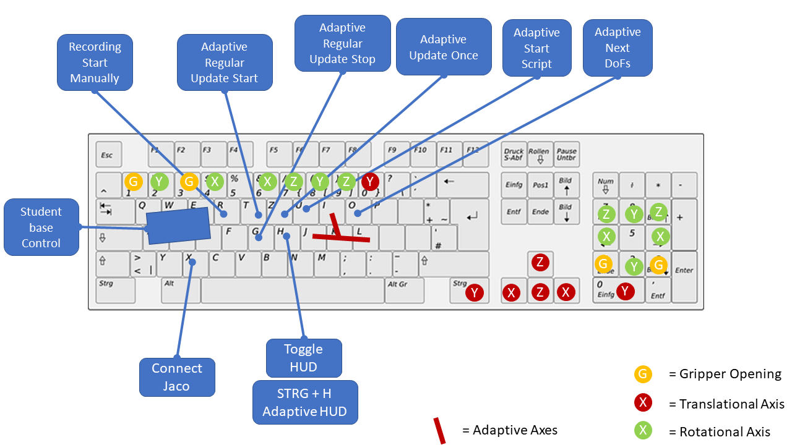
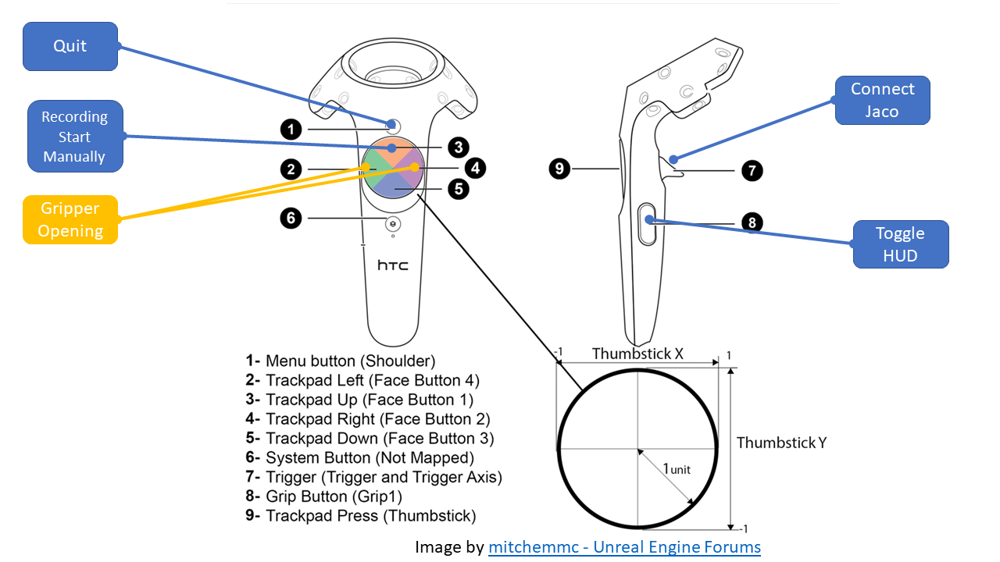

# Project notes 

Remark: This project has started as a student project and is therefore in some places a bit unorganised.

The project aims at enabling to control a Kinova Jaco in a variety of environments for the purpose of simulating activities and generating training data for a neural network. 

In order to generate training data, a custom replay system has been implemented. Please see    [Setup File and Replays](#setup-file-and-replays). Replays are based on the relative storage path of files in the project, therefore please don't change existing structures!

# Data Structure

The general setup is defined by the Unreal Engine. We attempt to have ReadMe files in all major folders to provide a project overview.

- [Adaptive](./Adaptive/README.md) 
- [other_resources](./other_resources/README.md) including [References](./other_resources/References.md)

# Miscellaneous Information

## Cameras and Rendering

The cameras render 3 images: RGB Color, Depth, and Segmented. Color and Depth are directly handled by the Engine. 

To enable segmentation of objects, the objects need to fulfil the following requirements:

- Object of Class (or Subclass) of `StaticMeshActor`
- Have an `Actor Tag` (or optionally for components in Blueprints individually a `Component Tag`) that is listed in the [`SegmentTable`](/Content/Structs/SegmentTable.uasset). This table can be arbitrarily extended up to 256 values. 
  - **Caution:** If multiple exist, the first Tag is being used. 

Cameras need to be activated before usage.

## Grasping

Sidenote: Grasping is not implemented via physics but instead using the following system: If no object is currently grasped, the fingers of the gripper are closing, and both the thumb (`Finger1`) and at least one of the other fingers collide with the object, it is physically connected as part of the gripper. Opening the fingers releases the object.

Based on the real Jaco, initially only the *Fingers* close, with the *FingerTips* closing only when there is force on the fingers, i.e. the fingers have already grasped something.

To enable grasping, the object to be grasped has to fulfil the following requirements:

- Object of Class (or child class of) `StaticMeshActor`
- Has the actor Tag `Graspable` (to be found under `Actor` ->*(extending options)* `Tags`)
- `Generate Overlap Events` activated (to be found under Collision->Generate Overlap Events)

## Setup File and Replays

The replay systems handles only **moveable** actors of class (or child class of) `StaticMeshActors`. For each such actor, it

1. Stores at initialisation: ID, Name, Path-to-Class, Path-to-StaticMesh, 3D-Scale, ActorTag
   - The *Path-to-X*-information is stored relative to the *Content* folder. This makes the recordings portable as long as the objects are not moved within the project.
   - The only exception to this is moving objects to the `_old` folder. Please see [the ReadMe](Content/_old/README.md).
2. Stores with *Storage_Frequency*: ID, 3D-Position, Rotation-Quaternion
3. Ignores physics whist running the replay

Everything else is omitted. The replay system **cannot** handle (among other things):

- Actor Settings defined in a level and not on a class level (i.e. Materials, Lighting, Rendering, Subcomponents...)
- Scale changes during the replay
- Object Deletions
- More than one Actor Tag (it will store the first tag that is in the SegmentationTable)
- Inner-Actor movements 

The exception to this is a single Jaco Robot (as found by `getActorOfClass(Jaco)`). For this it stores with *Storage_Frequency*: 

- The 3D-Position and Rotation-Quaternion in World Space for every joint
- The fingerValue and fingerTipValue as indicators of the grasping status 

It also stores the Position and Orientation of an HMD as the user's head.

---

During Replay, the ticks of all Actors are deactivated. The only exception are:

- The GameMode, as its tick handles the replay logic
- The PlayerController, as it allows for a user to view the replay while it is running
- Actors with the `TickDuringReplay`-Tag, i.e. specifically defined actors 

### Setup File

The *Setup.txt* file is used for custom configurations and loaded on every game start. It should be stored at the projects root directory. A template named *Setup_template.txt* exists. Parsing the file is handled by C++ code called by the actors requiring the information. Within the file, `#` can be used to toggle comments.  Only keywords used in the template file are implemented.

Please make sure to have only one replay status active (i.e. set to *true*): Either `PlayReplay` or `Record_Position_CSV`.

| Key                      | Meaning                                                      |
| ------------------------ | ------------------------------------------------------------ |
| StoragePath              | Absolute Path to the storage.  Without Iterator file: Path to a single replay.  With iterator file: Directory of iterator file and replay folders. |
| IteratorFile             | If not commented, is the name of a file used as iterator to store the current replay number. |
| PlayReplay               | If set, a stored replay is run.                              |
| Store_Images             | If a replay is running and this is set, images are being rendered by the cameras and stored. |
| High_Res_Images          | If storing images, this toggles if the cameras should use their high or low resolution option. |
| Record_Position_CSV      | If set, data of the simulation is stored as a single line in a regular time interval. |
| Storage_Frequency        | Frequency of recording. If set to 0 or below, the data is recorded every frame. |
| Recording_Start_Manually | If set to true, recording will not start automatically and needs to be called manually |
| Store_Headset_Images     | Whether to store images data from the headset (independent of Store_Images) |

### Button Mapping

