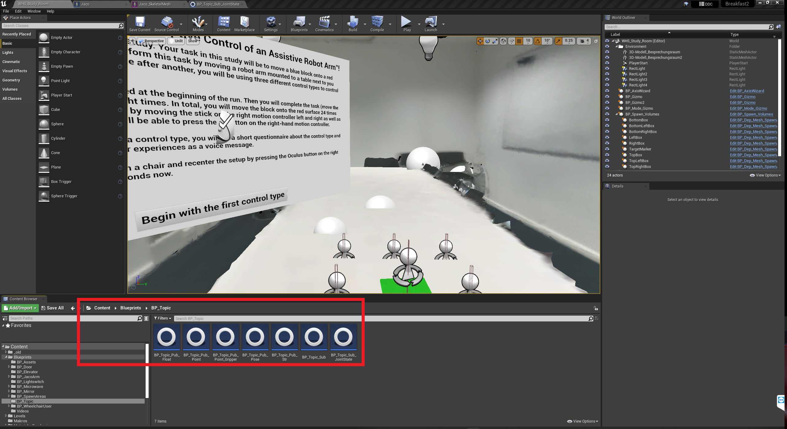

# AdaptiX – A Transitional XR Framework for Development and Evaluation of Shared Control Applications in Assistive Robotics

<aside>
💡 The previous project name, "Breakfast2", is still shown in some figures.

</aside>

---

**Research Article**

Preprint: [https://doi.org/10.48550/arXiv.2310.15887](https://doi.org/10.48550/arXiv.2310.15887)

How to cite:
```
@article{Pascher.2024adaptix,
title = {{AdaptiX – A Transitional XR Framework for Development and Evaluation of Shared Control Applications in Assistive Robotics}},
author = {Max Pascher and Felix Ferdinand Goldau and Kirill Kronhardt and Udo Frese and Jens Gerken},
doi = {},
url = {},
issn = {2573-0142},
year = {2024},
issue_date = {June 2024},
journal = {Proc. ACM Hum.-Comput. Interact.},
issn = {2573-0142},
volume = {8},
number = {EICS},
publisher = {Association for Computing Machinery},
address = {New York, NY, USA},
abstract = {With the ongoing efforts to empower people with mobility impairments and the increase in technological acceptance by the general public, assistive technologies, such as collaborative robotic arms, are gaining popularity. Yet, their widespread success is limited by usability issues, specifically the disparity between user input and software control along the autonomy continuum. To address this, shared control concepts provide opportunities to combine the targeted increase of user autonomy with a certain level of computer assistance. This paper presents the free and open-source AdaptiX XR framework for developing and evaluating shared control applications in a high-resolution simulation environment. The initial framework consists of a simulated robotic arm with an example scenario in Virtual Reality (VR), multiple standard control interfaces, and a specialized recording/replay system. AdaptiX can easily be extended for specific research needs, allowing Human-Robot Interaction (HRI) researchers to rapidly design and test novel interaction methods, intervention strategies, and multi-modal feedback techniques, without requiring an actual physical robotic arm during the early phases of ideation, prototyping, and evaluation. Also, a Robot Operating System (ROS) integration enables the controlling of a real robotic arm in a PhysicalTwin approach without any simulation-reality gap. Here, we review the capabilities and limitations of AdaptiX in detail and present three bodies of research based on the framework. AdaptiX can be accessed at https://adaptix.robot-research.de.},
keywords = {assistive robotics, human–robot interaction, shared user control, augmented reality, virtual reality, mixed reality, visual cues},
note = {preprint on arXiv: \href{https://arxiv.org/abs/2310.15887}{https://arxiv.org/abs/2310.15887}}
}
```

**Git repository**

<aside>
💡 Compilation errors may occur, caused by the bson header files.
A fatal error can occur that the files cannot be found. This has been fixed in the branch  by moving the folder with the header files to a folder found by the Unreal Engine and specifying the path to the header files directly.

</aside>

---

### Motivation

Controlling a physical Kinova Jaco2 is complex and takes some practice. In the Unreal Engine VR project "AdaptiX" an adaptive control method was developed, which simplifies the control of the robot for the user. 

The goal is to provide this simplified control method for a physical Kinova Jaco2. 

The idea of a AdaptiX is to synchronize the movement of a real and a virtual Kinova Jaco2 with each other. Because of this the physical Kinova Jaco2 can be controlled with the adaptive control method and the controller for the mixed reality headset. But also the virtual Jaco2 can be controlled with the remote for the physical robot. 

With the mixed reality headset Varjo XR-3 a wide spectrum of possibilities of use occur. 

The project “AdaptiX” can be used as a mixed reality project. The virtual Kinova Jaco2 gets laid over the physical robot. It could also be hidden and only the virtual cues on the real robot are visible for the user. 

The project can be used as a full VR project or as a mixed reality project where the real robot gets integrated in the virtual word (not done yet). For both the user could be in a different place as the physical Kinova Jaco2 and still control it by just seeing the virtual version. 

### Implementation

The heart of the system is the Unreal Engine project "AdaptiX". The project represents a VR simulation environment in which a virtual Kinova Jaco2 robot is mounted on a table and can be moved by the user in various motion modes.
For the AdaptiX, the simulation environment has been replicated in a laboratory.

The implementation of the AdaptiX basically consists of 3 main parts.

First, the integration of the mixed reality headset Varjo XR-3 and the trackers in the Unreal Engine project, together with the setup of the mixed reality application and the synchronization of the virtual robot and the real one.
Secondly we have ROS. The drivers of the Kinova Jaco2 are launched in ROS and a self-written ROS Node is used to process data from the Unreal Engine and to control the real Jaco2.

Last but not least, the setup of a ROS interface in the Unreal Engine project. The ROSIntegration plugin allows the Unreal Engine to communicate with a ROSBridge. Thus, we have bidirectional communication interface between the Unreal Engine and ROS.

**Unreal Engine project, XR- and tracking-hardware**

The relevant values to move the virtual robot according to the movement of the real robot are the position and rotation of the real robot’s tool center point and the angles of the fingers. The position and rotation values have to be modified, as Unreal Engine uses left-handed coordinate systems and ROS uses right-handed ones. Also with the rotation an offset has to be added, because the virtual Jaco is put together different to the real one. Furthermore for the position the values have to be converted from meters to Unreal Units (centimeters). After these modifications the virtual Jaco’s tool center point is set to the new position and rotation and the fingers are set to the new angles. This happens every time a new message about the real robot’s status comes in.

When the real Jaco is moved according to the virtual Jaco’s movement, the same information from the virtual Jaco is needed. These also need to be modified again. So the left-handed coordinate system is converted into a right-handed one, the rotation has an offset added to it and the position values are converted from Unreal Units (centimeters) to meters. The modified values then get send out every 0.1 seconds.

To use the Varjo XR-3 headset and it’s corresponding hardware, such as the HTC Vive controller, used for controlling the project, SteamVR is needed. Via four SteamVR Base Stations the headset, the controller and two additional trackers are tracked in the room. Over SteamVR they are all connected and accessible in the Unreal Engine project.

Using the XR-3 enables the project to be experienced in mixed reality. This opens up the possibility to combine the real robot with the adaptive controls and visualizations of the “AdaptiX” project. To achieve mixed reality in the project, a “Post Process Volume” and a “Post Process Material” are used. They are set up so that the background of the virtual environment gets replaced by the images of the see through cameras of the XR-3 headset.

For the visual cues of the project to be useful, the virtual and the real robot have to be synchronized in position and rotation. The result is that they appear to completely overlap from the user’s point of view. For that to be possible, two trackers are needed, that are fixed in place relative to the real robot. The positions of these tracker are then accessible in the Unreal Engine project via the plugins “LiveLink” and “LiveLinkXR”. The first tracker is needed to get a constant position relative to the real robot. The second one is used in conjunction with the first tracker to get a constant direction in the room. Furthermore the synchronization has to be calibrated with four values, to describe their position relative to the robot. With all this information the position of the real robot in the virtual environment can be calculated. Then the virtual environment gets re-positioned and re-rotated, so that in the user’s point of view the real robot and the virtual robot have the same position and rotation.

There are three ways to integrate the virtual robot in the view. First you can have the entire virtual robot visible. The second option is to hide the entire virtual robot and only show the virtual cues. The third option is to only show the robot’s gripper together with the virtual cues.

.png)

Option 1: The entire virtual robot is visible with the virtual cues

.png)

Option 2: The entire virtual robot is hidden and only the virtual cues are shown

.png)

Option 3: Only the gripper of the virtual robot are shown with the virtual cues

**Controlling the Kinova Jaco2 with ROS**

To control the Kinova Jaco2 using software, the Robot Operating System, or ROS for short, is used. By using the repository "kinova-ros" from kinovarobotics, ROS has access to the robot and its drivers.

Once the drivers are launched, ROS can be used to communicate with the robot. The launched drivers create different ROS topics. Some are used to put out current values of the robot. Others are used to receive new targets or values as commands.

The two important topics for the project, on which the robot publishes, are "/j2s7s300_driver/out/joint_state" and "/j2s7s300_driver/out/tool_pose".
The first topic provides the angular values of the fingers and fingertips.
The second topic provides the current position and orientation of the tool center point of the Kinova Jaco2. 

The robot subscribes to the topics "/j2s7s300_driver/pose_action/tool_pose" which expects position and rotation targets for the tool center point and "/j2s7s300_driver/fingers_action/finger_positions" which expects position values from 0 to 6800 for the fingers. The messages of the topics are motion commands and can only be published by action clients. The messages of the topics are motion commands for Kinova Jaco2 and can only be published by action clients.

To control the robot using the two topics, the custom ROS node  “UE_Robot_Connection.py” was written. In this node are two subscribers for two self-created topics. The arm subscriber listens to the topic "/UE_TCP_position" and receives position and rotation data. With each new message it calls the simple action client "cartesian_pose_client" and this sends the data, when the values changed, received from the topic as new movement target to the topic "/j2s7s300_driver/pose_action/tool_pose". The gripper subscriber receives radiant angles for the finger from the topic "/UE_Gripper_angles" and calls the simple action client “gripper_client” with this data. The simple action client modifies the angles to position values and sends these, when the values differ from the last target, as a new target to the topic "/j2s7s300_driver/fingers_action/finger_positions". 

With this concept the Kinova Jaco2 can be controlled with the values position and rotation value of the topic "/UE_TCP_position" and the finger angles of the topic "/UE_Gripper_angles".

**ROS-Interface for the Unreal Engine and the communication scheme**

For the Unreal Engine 4 project to be able to communicate with ROS as a non-ROS program, it requires the ROSIntegration plugin on the Unreal Engine 4 side and a ROSBridge must be set up on the ROS side. The ROSIntegration communicates with the ROSBridge, which enables a message exchange with the ROS environment.

In the Unreal Engine project publishers for the topics "/UE_TCP_position" and "/UE_Gripper_angles" are realized. Also two subscribers are created in the Unreal Engine project for the topics "/j2s7s300_driver/out/joint_state" and "/j2s7s300_driver/out/tool_pose". For this Unreal Engine data types are translated into ROS message types and vice versa. 

With these subscribers and publishers a bidirectional between the Unreal Engine project and the ROS controlled robot can be established. This communication is based on the following communication scheme.


Communication scheme of the AdaptiX

ROS is the core of the communication and manages the message exchange between the Unreal Engine project and the robot.

The control direction - *robot to Unreal Engine* - means that the virtual Kinova Jaco2 simulates the movements of the real one. This direction of communication runs through two topics. The real Kinova Jaco2 sends its current pose of the tool center point to the topic "/j2s7s300_driver/out/tool_pose" and through the corresponding subscriber in the Unreal Engine, this pose data is made usable for the virtual Jaco2. To the other topic "/j2s7s300_driver/out/joint_state" the real robot sends its current finger angles and these are made usable by the appropriate subscriber in the Unreal Engine for the virtual Jaco2.

The other control direction - *Unreal Engine to robot* - means that the real Kinova Jaco2 follows the virtual one's movements. For this communication direction the own ROS node "UE_ROS_Connection.py" is used. This node controls the real Kinova Jaco2 according to the values of the messages of the topics "/UE_TCP_position" and "/UE_Gripper_angles". Unreal Engine sends a modification of the current pose consisting of position and rotation of the tool center point of the virtual Kinova Jaco2  to the topic "/UE_TCP_position" via the publisher for this topic. The ROS node will pass the pose data to the real robot. To the other topic "/UE_Gripper_angles" Unreal Engine sends the current finger angles of the virtual robot. Here the ROS node will calculate the finger angle into finger positions and pass the data to the real Kinova Jaco2. 

To change between the control and communication directions a control switch is implemented in the Unreal Engine project. It switches between the control direction by pause and unpause the publisher or subscriber of the Unreal Engine.

When sending new targets too often with the simple action client to the robot, the drivers are overloaded. One can see that the drivers are overloaded, especially the gripper driver, because they start to open again while moving the robot arm. Because of this, both action clients filter out unchanged values and do not send them as targets to the robot. As an extra benefit of this solution the rate of the publisher of the Unreal Engine can be set down to 0.1 seconds and the robots synchronize faster. A disadvantageous side effect of the fast synchronization and the filter in the simple action client for the gripper is that the gripper does not have enough time to reach the target. To account for that, the gripper synchronization gets activated one more time each time the arm’s movement is completed.

---

## Resources

### Hardware

- Varjo XR-3
- HTC Vive Controller
- 2x HTC Vive Tracker 2.0
    - Dongle for the second tracker
- 4x SteamVR Base Station 2.0
    - 4x attachments (e.g. tripods or mounting kits)
- Kinova Jaco2
- PC with Windows 10 or 11 for Unreal Engine 4.27
    - It has to have either two DisplayPort or Mini DisplayPort ports on the graphics card.
- PC with Ubuntu 18.04 for ROS

### Software

- ROS melodic (Ubuntu 18.04)
- Unreal Engine 4.27 (Windows 10/11)
    - Visual Studio 2019
- ROSBridge server
- ROSIntegration plugin for Unreal 4.27
- kinova-ros packages from kinovarobotics
- AdaptiX (Unreal Engine project)
- Kinova DevelopmentCenter
- SteamVR
- Varjo Base Version 3.7.2.13

---

## Hardware setup

### Example Network overview


Last Update 16.09.2022 

### Setting up the Kinova Jaco2

The Kinova Jaco2 should be installed according to the manufacturer's instructions. It is important that it is stable and that the fastening does not loosen due to the vibrating movements. The best way to build the lab is to emulate the simulation in the Unreal Engine. It is essential that the connections to the robot base are rotated 180 degrees. In the simulation, the connectors point to the left, in the real world, they must point to the right. 
It is possible to modify the structure of the laboratory, but the reference to simulation will be more difficult to see.
If the red target area should also be present in the real world, the exact positioning must be determined. This is also dependent on where the robot is positioned, since the positional relationship between the robot and the target area must remain the same.
After a new setup or changes to the setup, the system must be re-calibrated.

The manufacturer's control software “Kinova DevelopmentCenter” must be installed on the Windows computer and connected to the Kinova Jaco2. This software can be found on the supplied USB stick.

### SteamVR Base Station placement

- Place the base stations around the work area.
- They should be placed above head height, ideally higher than 2m.
    - For that you can either use mounting kits or tripods.
- They should be placed at least 0.5m away from the work area, but not more than 7m.
- They should all roughly face the work area.
- To turn them on, plug them into a power outlet.

For further information visit: [https://www.vive.com/ca/support/vive-pro/category_howto/installing-the-base-stations.html](https://www.vive.com/ca/support/vive-pro/category_howto/installing-the-base-stations.html)

### HTC Vive Tracker placement

<aside>
💡 If you want to use the system for an extended amount of time, make sure to place the trackers close enough to a power outlet to charge them while using the system.

</aside>

- The system uses two trackers to synchronize the virtual and the real robot.
- Before placing the trackers, keep in mind that they should not be moved around after that. Otherwise you have to do do the calibration (see below) again.
- They have to be mounted relatively tight, as even small offsets can affect the accuracy of the synchronization.
- Their rotations and are not relevant.
- Make sure not to place them in the usual work area of the robot.
- Make sure there are clear lines of sight to at least two of the base stations.
- Tracker 1:
    - The first one is used to get a constant position relative to the robot.
    - It should be placed close to the real robot, but not too close, because that causes difficulties to track it.
    - The distance should be at least 20cm but not much more.
    - Ideally it should be attached directly to the robot.
- Tracker 2:
    - The second one is used to get a constant direction in the room between the first and the second tracker.
    - It can be placed wherever the Base stations can see it and the robot can not reach it.
    - You also need to have the dongle plugged into your Windows PC to use a second tracker.

### Connecting the Varjo XR-3

<aside>
💡 Here the setup with two headset adapters is used. If you have another adapter setup, please visit the following website and have a look at step 6 for instructions on how to set that up: [https://varjo.com/use-center/get-started/varjo-headsets/setting-up-your-headset/setting-up-xr-3/](https://varjo.com/use-center/get-started/varjo-headsets/setting-up-your-headset/setting-up-xr-3/)

</aside>

- Do the following for each of the two headset adapters:
    - Connect it to a DisplayPort on the graphics card.
    - Connect it to a USB-A 3.0/ 3.1 port on the motherboard.
    - Connect it to a power outlet.
    
    ](Ressources/con_var_2_adapters.png)
    
    source: [https://varjo.com/use-center/get-started/varjo-headsets/setting-up-your-headset/setting-up-xr-3/](https://varjo.com/use-center/get-started/varjo-headsets/setting-up-your-headset/setting-up-xr-3/)
    
- Only connect the two headset cables A and B each into one of the headset adapters when you want to use the headset, as that will turn it on.

---

## Software setup

### ROS setup

<aside>
❗ You have to have installed Ubuntu 18.04 on your PC.

</aside>

### Installing ROS

The following commands must be typed in a terminal.

**Set up your sources.list:**

```bash
sudo sh -c 'echo "deb http://packages.ros.org/ros/ubuntu $(lsb_release -sc) main" > /etc/apt/sources.list.d/ros-latest.list'
```

**Set up your keys:** 

```bash
# if you haven't already installes curl
sudo apt install curl

curl -s https://raw.githubusercontent.com/ros/rosdistro/master/ros.asc | sudo apt-key add -
```

**Installation:**

```bash
sudo apt update

sudo apt install ros-melodic-desktop-full
```

**Environment setup:**

```bash
echo "source /opt/ros/melodic/setup.bash" >> ~/.bashrc

source ~/.bashrc
```

Dependencies for building packages:

**Initialize rosdep:**

```bash
sudo apt install python-rosdep
sudo rosdep init
```

*For further information visit: [http://wiki.ros.org/melodic/Installation/Ubuntu](http://wiki.ros.org/melodic/Installation/Ubuntu)*

### Setting up the ROS environment

```bash
source /opt/ros/melodic/setup.bash
```

Create and build a catkin workspace:

```bash
mkdir -p ~/catkin_ws/src
cd ~/catkin_ws/
catkin_make
```

To make sure your workspace is properly overlayed by the setup script, make sure ROS_PACKAGE_PATH environment variable includes the directory you're in.

```bash
source devel/setup.bash
echo $ROS_PACKAGE_PATH
```

The output of this should now be:

```bash
/home/youruser/catkin_ws/src:/opt/ros/melodic/share
```

Automatically source the workspace every time you open a terminal window (necessary if you want to use the terminal launch script):

```bash
echo "source catkin_ws/devel/setup.bash" >> ~/.bashrc
```

*For further information visit: [http://wiki.ros.org/ROS/Tutorials/InstallingandConfiguringROSEnvironment](http://wiki.ros.org/ROS/Tutorials/InstallingandConfiguringROSEnvironment)*

### Installing ROSBridge

```bash
sudo apt-get install ros-melodic-rosbridge-server
```

*For further information visit: [http://wiki.ros.org/rosbridge_suite](http://wiki.ros.org/rosbridge_suite)*

### Installing Kinova ROS packages

<aside>
💡 The order of commands differs from the one on the linked GitHub page below.
This is needed to avoid an error with the installation process.

</aside>

Install of Kinova-ROS:

```bash
cd ~/catkin_ws/src
git clone https://github.com/Kinovarobotics/kinova-ros.git kinova-ros
```

Installation of MoveIt:

```bash
sudo apt-get install ros-melodic-moveit
sudo apt-get install ros-melodic-trac-ik
```

Installation of Gazebo:

```bash
sudo apt-get install ros-melodic-gazebo-ros*
sudo apt-get install ros-melodic-gazebo-ros-control
sudo apt-get install ros-melodic-ros-controllers
sudo apt-get install ros-melodic-trac-ik-kinematics-plugin
```

Build your workspace:

```bash
cd ~/catkin_ws
catkin_make
```

<aside>
❗ The catkin_ws/src/kinova-ros/kinova_bringup/launch/confic/robot_parameters.yaml must be configurated:

- connection_type must be Ethernet
- local_machine_IP must be the IP of the PC (IP of the RobotControl-PC in the laboratory is 172.31.1.58 as of the 25.08.2022)
</aside>

*For further information visit: [https://github.com/Kinovarobotics/kinova-ros#installation](https://github.com/Kinovarobotics/kinova-ros#installation), [https://github.com/Kinovarobotics/kinova-ros/tree/melodic-devel/kinova_gazebo#installation](https://github.com/Kinovarobotics/kinova-ros/tree/melodic-devel/kinova_gazebo#installation), [https://github.com/Kinovarobotics/kinova-ros/tree/melodic-devel/kinova_moveit#installation](https://github.com/Kinovarobotics/kinova-ros/tree/melodic-devel/kinova_moveit#installation)*

### Setting up the launch script

Install xterm:

```bash
sudo apt install xterm
```

Navigate to the directory the launch script and the python script are saved in (by default it is in the repository in the “ROS” folder).

Make the launch script executable:

```bash
chmod +x AdaptiX_launch_V0.2.sh
```

### Unreal Engine setup

### **Installation of Unreal Engine**

<aside>
❗ Install Visual Studio 2019.

</aside>

To install and launch Unreal Engine, **Epic Games Launcher** must be installed. Install it by accessing the [Download Epic Games](https://store.epicgames.com/en-US/download) Launcher page.

An Epic Games account is needed to install and work on Unreal Engine.

All the Unreal Engine installations can be managed in the **Unreal Engine tab** in the Epic Games Launcher.

To install the Unreal Engine there is a ➕  button next to the Engine Versions. It will show the last version of the Unreal Engine.

<aside>
❗ For this project **Unreal Engine 4.27** version was used. So you need to continue with the same version.

</aside>

By clicking on the dropdown button one can change the version.

*For further information visit:*

[Installing Unreal Engine](https://docs.unrealengine.com/4.27/en-US/Basics/InstallingUnrealEngine/) page

### **Installing ROSIntegration**

- **Setting up the plugin**
    
    The ROSIntegration plugin is available in the [GitHub repository](https://github.com/code-iai/ROSIntegration).
    
    To start, add that repository to the Unreal Project in the plugin folder and compile the C++ code of the project. 
    
    After adding the repository to your project folder, you need to activate it by going through Edit→Plugins. The ROSIntegration can be found and activate in the section “other”.
    
    <aside>
    ❗ Try to restart the editor before checking if the code for the new plugin is built.
    
    </aside>
    
    - **Problems with the bson header files**
        
        When compiling, fatal errors can occur that the bson header files are not found. The folder <UnrealEngineProjectFolder>/Plugins/ROSIntegration/ThirdParty, which contains the folder for the bson header files, is not found by the Unreal Engine. So the folder <UnrealEngineProjectFolder>/Plugins/ROSIntegration/ThirdParty/bson must be moved or copied to another found folder and the include path in the affected files must be specified directly. This has been done in this repository at the branch whs-branch-twin-ros.
        If you install the project with this solution on a new system, it can happen that another fatal error occurs. This one says that a LINK error has appeared. This can be fixed by using the old includes of the bson header files again.
        
- **Creating ROSIntegrationGameInstance**
    
    ROSIntegrationGameInstance is needed to configure the ROSBridge server. You have to create a new Blueprint class inherited by ROSIntegrationGameInstance which you can find in the Content browser. 
    
    When you enter your new blueprint class defaults, you can change the values of ROSBridgeServerHost and ROSBridgeServerPort.
    

### Building the project from source

When trying to open the Unreal Engine project after downloading it, an error message may appear that the project cannot be compiled and that one should try to rebuild it from source.


The following steps may help:

- Go to the folder of the Unreal Engine project and right click on the project “AdaptiX”. Then click on “Generate Visual Studio project files”.
    
    .png)
    
- After that the file “AdaptiX.sln” should appear.
- Open “AdaptiX.sln” with Visual Studio and build or rebuild the project. Therefore have a look in the documentary “Development”→ “Compiling and building C++ code in Unreal Engine”.
- After compiling the project close Visual Studio and try to launch the project again.
- It may take some tries to launch the project. It also can help to build the project several times and change the “Solution Configurations” to “Development Editor”.
    
    .png)
    

### Varjo XR-3 Setup (Varjo Base and SteamVR)

<aside>
❗ You need a commercial Varjo account.

</aside>

<aside>
❗ You need a Steam account.

</aside>

### Installing SteamVR

- Install Steam
    - Download the Setup here: [https://store.steampowered.com/about/](https://store.steampowered.com/about/)
- Open up Steam.
- Install SteamVR from the Steam store.

### Installing Varjo Base

Install Varjo Base Version 3.7.2.13 (here 3.7.2) from here: [https://account.varjo.com/downloads/varjo_base/varjo_base/versions](https://account.varjo.com/downloads/varjo_base/varjo_base/versions)

Follow the first time setup.

### Setting up Varjo Base

There are some specific settings in the “System” tab that are necessary to run the project:

- Set “Headset tracking” to “SteamVR”.
- Turn “Mixed Reality for OpenVR” on.

<aside>
❗ If you are using other tracker hardware compared to the original setup, you need to integrate them into the Unreal Engine project. For that, have a look at “Integrating new trackers into the Unreal Engine project” in the “Development” section down below.

</aside>

<aside>
❗ To start the Unreal Engine project the Varjo XR-3 headset has to be connected to the PC. Otherwise Unreal Engine will crash at start.

</aside>

### Calibrating the synchronization

To calibrate the synchronization of the virtual and the real robot, you need to set 4 variables according to the setup of your trackers relative to the robot. The variables are located in the blueprint “BP_GM_Study”, located in the Unreal Engine Project in Content/WHS_HCI_Study/Blueprints: “DistanceTrackerToJaco”, “DirectionTrackerToJaco”, “HeightDifferenceTrackerToJaco”, “RotationTrackerToJaco”. You can find these variables in the blueprint “BP_GM_Study”, located in the Unreal Engine Project in Content/WHS_HCI_Study/Blueprints. To get to the correct values for each variable, follow these steps:

<aside>
❗ Keep in mind, that only the grippers and the bases of the virtual robot and the real robot will be synchronized. If the rest of the robots is a little bit different from each other, that is not a problem.

</aside>

<aside>
💡 For the best accuracy when checking if the robots are well synchronized you have to go very close to the robot. The further you are away the more inaccurate the visualization in the mixed reality headset is.

</aside>

- For every step there are two picture of an example of how it should look when the step is done.
    
    
    - Starting point without calibration:
        
        
        
    
    - Starting point without calibration with the virtual robot hidden:
        
        
        
    - Because the value of “DirectionTrackerToJaco” is still set to 0, the virtual robot will appear on tracker 1 at first.
- Roughly measure the distance between tracker 1 and the robot. Do not factor in the height difference, just use the horizontal distance. Use this value in centimeters for the variable “DistanceTrackerToJaco”.
    
    
    - Standard view:
        
        
        
    
    - Top down view of the bases and the tracker:
        
        
        
    - The distance between the tracker and the virtual robot and the distance between the tracker and the real robot are now roughly the same.
- Roughly measure the height difference between tracker 1 and the base of the robot. If the tracker is above the base of the robot this value is negative. If it is under the base it is positive. Use this value in centimeters for the variable “HeightDifferenceTrackerToJaco”.
    
    
    - Standard view:
        
        
        
    
    - Side view of the bases:
        
        
        
    - The bases of the virtual robot and the real robot are now roughly on the same height.
- For the remaining steps you have to start the System each time and adjust the values until they are correct.
- The variable “RotationTrackerToJaco” is used to set the rotation of the virtual robot. Use values between 0 and 360 (or between -179 and 180, if you prefer that) to adjust the degree of the rotation until it roughly matches the real robot.
    
    
    - Standard view:
        
        
        
    
    - Top down view of the grippers:
        
        
        
    - The grippers of the virtual and the real robot now roughly point in the same direction
- The variable “DirectionTrackerToJaco” is used to set the direction in which the virtual robot is located relative to tracker 1. Use values between 0 and 360 (or between -179 and 180, if you prefer that) to adjust the degree of the direction until the virtual robot’s base location and the real robot’s base location match directionally.
    
    
    - Standard view:
        
        
        
    
    - Close up view of the bases:
        
        
        
    - The bases of the virtual robot and the real robot are in the same direction relative to the tracker now.
- Now you can fine tune the other values to match the real robot as close as possible.
    
    
    - Standard view:
        
        
        
    
    - Top down view:
        
        
        
    - The bases and grippers of the virtual and the real robot are completely synchronized.

<aside>
💡 If you do not want to or can not measure the distance and height difference, you can also get these values by iteratively checking and adjusting the values.

</aside>

<aside>
💡 If you want to get a good starting value for the rotation and direction you can do the following. Compare the virtual and the real robots rotation/direction and estimate the difference in degrees. From a top down view on the tracker, clockwise means negative.

</aside>

---

## Using the system

### Launching the system

- Start the Windows PC and the Ubuntu PC.
- Start Varjo Base on the Windows PC.
- Start the Varjo XR-3 headset by plugging the two cables A and B each into one of the headset adapters, which should already be plugged in correctly.
- If SteamVR did not start automatically, start it.
    - There could also be a window opened, in which you are told to restart SteamVR.
    - If you can not start SteamVR, it should open automatically when you open up the Unreal Engine project in a later step.
- Plug the Base Stations into a power outlet.
- Start and connect the Trackers by holding the power button in the middle for 5 seconds.
    - The status light should turn blue. That means it is trying to connect.
    - When it is connected, the status light turns green.
- Do the same for the controller by holding the system button below the trackpad.
- If you want to, you can test if the controller and the trackers are tracked correctly:
    - Put on the headset loosely. Hold it with one hand so you can easily take it on and off.
    - Look at a tracker or the controller in the real world and memorize where it is.
    - When you put on your headset you should see the virtual tracker or controller in the exact same place.
- If you use the system for the first time after setting everything up, or you changed the position of a base station, you should do a SteamVR room setup.
    - Go into SteamVR and click on Room Setup.
    - Choose “Set up for Room-Scale”.
    - Follow the instructions, but keep in mind that the user will also see the real world, so you do not have to care about obstacles in the room.
    - In the step “Create some boundaries” you can choose the advanced mode and just click the trigger roughly at each base station.
- Start the robot and put it into the home position.
- Set the connection type of the Kinova Jaco 2 to ethernet.
    - Detailed instruction (by Max Pascher)
        
        
        
        
        
        
        
        
        
        
        
        
        
        
        
        <aside>
        ❗ You have to close theses windows afterwards!
        
        </aside>
        
- Execute the launch script on the Ubuntu PC:
    - Detailed instructions
        - Open up a terminal by pressing Ctrl + Alt + T.
        - If you are launching the script for the first time after booting up the PC, you should first execute the command “roscore” once.
            - Type in:
                
                ```bash
                roscore
                ```
                
            - Wait until no more text appears and the last line says:
                
                ```bash
                started core service [/rosout]
                ```
                
            - Then press “Crtl” + “C”.
        - First navigate into the folder in which the launch script and the python script are located.
        - Execute the launch script with:
            
            ```bash
            ./AdaptiX_launch.sh
            ```
            
- Open up the Unreal Engine project “AdaptiX” on the Windows PC.
- Add in the trackers:
    - Detailed instructions
        - In the project “AdaptiX” on the bottom left click on the tab “LiveLink”.
            
            
            
        - Then click on the green “Source” button.
            
            
            
        - Then go into “LiveLinkXR Source” and click on the “Add” button.
            
            
            
        - There should appear two rows saying “SteamVRTracker…” with a green status light.
            
            
            
- Start the project by clicking “Play” in the top of the window.
    - Make sure it is set to “VR Preview” in the drop down menu.
- Put on the Headset, take the controller in your preferred hand and use the system.

### Controls

<aside>
💡 Some controls are only available with the keyboard, as there are not enough input possibilities with the HTC Vive controller to include all options.

</aside>

### HTC Vive Controller


- Trackpad touch up/down: move in/against primary direction
- Trackpad touch left/right: move in/against secondary direction
- Trackpad press left: gripper open
- Trackpad press right: gripper close
- Menu button: change direction mode
- Trigger: press button in menu

### Keyboard


- left mouse button: press button in menu
- I: move in primary direction
- K: move against primary direction
- J: move in secondary direction
- L: move against secondary direction
- R: change direction mode
- P: change controlling system (switch between Unreal Engine in control and ROS in control)
- Ü: hide/unhide virtual robot, except for the fingers
- Ä: hide/unhide virtual robot completely
- Ö: unhide/hide virtual environment

### Common problems

### ROS-Warning: Disk usage in log directory over 1 GB


When executing the launch file, this error may occur. 

Stop the launch script with [Ctrl] + [C]. 

Delete the ROS log files with the following command:

```bash
rosclean purge
```

Restart the launch script.

### Kinova Jaco2 ROS drivers crash

Sometimes the drivers for the robot crash in ROS.
The most common reason is a bad Ethernet connection between the robot, ROS and the Kinova DevelopmentCenter. Also that the Kinova DevelopmentCenter changes the connection type. 

The error can be solved by restarting the launch script. If the error occurs at the start, first check that the connection type is set correctly in the Kinova DevelopmentCenter and that the application has been closed.
If the error still occurs, restart the whole system again.

### Gripper of the Kinova Jaco2 does not move anymore

When the Jaco's grippers stop responding to control commands, both from ROS (and Unreal Engine) and from the actual controller, the finger drivers have crashed.

Turn off the robot completely as usual and wait a few seconds.

Then turn it back on as usual and test the fingers.

<aside>
❗ The connection type must be set to “Ethernet” in the Kinova DevelopmentCenter again.

</aside>

### A tracker is not starting

Sometimes, even when the tracker is charged, the tracker will not start. You can start it by plugging it into a power outlet. Then it should start, even when you unplug it again afterwards.

### A tracker is not connecting

Make sure the tracker is visible for at least two of the active base stations and that the dongle for the second tracker is plugged into your Windows PC. 

Sometimes the trackers have difficulties to connect when they are plugged into a power outlet. Unplugging it and trying again often helps.

### The controller is not tracked correctly

Sometimes it can happen that the positions of the real controller and the virtual controller are desynchronized. Most of the times this is fixed by restarting the controller.

If that does not solve the problem, try restarting the Windows PC part of the system.

### The synchronization of the real robot and the virtual robot does not work correctly

Make sure that:

- You have added in the trackers into the Unreal Engine project.
- You recalibrated the synchronization if you moved the robot or a tracker.
- The trackers are connected and tracked correctly.

---

## Development

Here you can find some explanations and tutorials that may be useful for developing the project further.

<aside>
❗ To start the Unreal Engine project the Varjo XR-3 headset has to be connected to the PC. Otherwise Unreal Engine will crash at start.

</aside>

### Communication scheme and topic explanations


Last Update 09.02.2023 - topics are based on the robot type j2s7s300

### **/UE_TCP_position**

**Explanation of the topic:**

This topic is used to send the position and orientation of the Tool Center Point (TCP) of the Unreal Engine robot to ROS.
In Unreal Engine the pose of the TCP is given by a point with x, y and z values. 
The orientation is given in a quaternion.

**Message type**: 

geometry_msgs.msg/Pose

**Structure of the message type:**

```bash
geometry_msgs/Point position
geometry_msgs/Quaternion orientation
```

Structure of the message type Point:

```bash
float64 x
float64 y
float64 z
```

Structure of the message type Quaternion:

```bash
float64 x
float64 y
float64 z
float64 w
```

**Example to publish to this topic with the terminal:**

```bash
rostopic pub /UE_TCP_position geometry_msgs/Pose '[0.077, -0.199, 0.774]' '[0.0, 0.0, 1.047, 0.0]'
```

### /UE_Gripper_angles

**Explanation of the topic:**

Over this topic Unreal Engine sends the angles of each finger of the simulated robot.

**Message type:** 

geometry_msgs.msg/Point

**Structure of the message type:**

```bash
float64 x
float64 y
float64 z
```

**Example to publish to this topic with the terminal:**

```bash
rostopic pub /UE_Gripper_angles geometry_msgs/Point '1.0' '0.0' '0.0'
```

### /j2s7s300_driver/pose_action/tool_pose

**Explanation of the topic:**

This topic is the action address for the action client “cartesian_pose_client”.  The action client communicates with the drivers of the Kinova Jaco2 and sends position goals for the Tool Center Point.

### /j2s7s300_driver/fingers_action/finger_positions

**Explanation of the topic:**

This topic is the action address for the action client “gripper_client”.  The action client communicates with the drivers of the Kinova Jaco2 and sends position goals for the fingers. The positions are given values between 0 (open) and 6800 (close). 

### /j2s7s300_driver/out/joint_state

**Explanation of the topic:**

This topic is only used with the Jaco2 in the laboratory (24.08.2022). 

<aside>
💡 If the robot is not the same robot any more the robot type (here j2s7s300) might change. Please change it to the right type and check if the topic with the other robot type exist.

</aside>

The topic is created by the robot drivers and provides several information about the robot. 
The Unreal Engine subscribes to this topic and only uses the position values. 
The position has 13 values. Unreal Engine only needs the values 8-10 are the angles of the gripper. 11-13 are values for the finger tips.

**Message type:**

sensor_msgs/JointState

**Structure of the message type:**

```bash
std_msgs/Header header
string[] name
float64[] position
float64[] velocity
float64[] effort
```

### /j2s7s300_driver/out/tool_pose

**Explanation of the topic:**

This topic is only used with the Jaco2 in the laboratory (24.08.2022). 

<aside>
💡 If the robot is not the same robot any more the robot type (here j2s7s300) might change. Please change it to the right type and check if the topic with the other robot type exist.

</aside>

The topic is created by the robot drivers and provides the pose of the Tool Center Point of the Jaco2. The pose contains position and orientation (see definition in “/UE_TCP_position”).

The Unreal Engine subscribes to this topic.

**Message type:**

geometry_msgs/PoseStamped

**Structure of the message type:**

```bash
std_msgs/Header header
geometry_msgs/Pose pose
```

### ROS Node (python script)

Name: UE_Robot_Connection.py

<aside>
💡 If there are questions about how to use ROS, the ROS tutorials can help. Make sure to use the correct ROS version. (ROS melodic with catkin - state: 07.02.2023)
The tutorials can be found at [http://wiki.ros.org/ROS/Tutorials](http://wiki.ros.org/ROS/Tutorials)

</aside>

The communication from Unreal Engine to the robot is enabled by the python script. 
There are two subscribers there. These listen to the topics that Unreal Engine publishes. These messages are then processed in the callback of the subscriber and adjusted for the real robot. In the callback, the respective action clients are called with the data. With the implemented simple action client, the position, rotation and angle data can be passed onto the robot. Then they are processed by the drivers and the robot is moved.

<aside>
💡 In the repository “kinova-ros” are examples for the use of ROS to program the robot

</aside>

The simple action clients work directly on the drivers of the robot. The clients used in the python script are simplified and slightly modified copies from the examples in the repository. 
Each time the client gets a new goal, the old goal is deleted. This avoids queues and keeps the path to the desired position short.

- Simple Action Clients:
    - cartesian_pose_client (Topic: /j2s7s300_driver/pose_action/tool_pose)
    - gripper_client (Topic: /j2s7s300_driver/fingers_action/finger_positions)
- Subscribers:
    - Arm subscriber (Topic: /UE_TCP_position, Pose message type)
        - callback_arm
    - Gripper subscriber (Topic: /UE_Gripper_angles, Point message type)
        - callback_gripper

<aside>
❗ When using the action client, please make sure not to send to often goals. This overloads the driver especially the for the gripper. 
At the moment the action clients only sends a new goal to the driver when the desired goal values change.

</aside>

### **Creating subscriber and publisher for ROS topics in Unreal Engine** (ROSIntegration)

By default, the only message type that is ready to be used in the Unreal Engine is the String message type, for publishing and subscribing. 

- [Supported message types](https://github.com/code-iai/ROSIntegration#supported-message-types) in the ROSIntegration plugin

In this case, the **[Point](http://docs.ros.org/en/noetic/api/geometry_msgs/html/msg/Point.html)**  message type will be shown as an example for publishing to a topic and the **[JointState](http://docs.ros.org/en/noetic/api/sensor_msgs/html/msg/JointState.html)**  message type will be exemplified for subscribing to a topic.

The **blueprints** for publishers and subscribers are located in the folder **Content/Blueprints/BP_Topic**, as shown in the screenshot below.



In the **code**, the Topic.cpp and Topic.h files must be edited to include new publishers and subscribers. The files can be found in the following folders:

- Topic.cpp path: Plugins/ROSIntegration/Source/ROSIntegration/Private/Topic.cpp
- Topic.h path: Plugins/ROSIntegration/Source/ROSIntegration/Classes/RI/Topic.h

### **Publish to topics (Point type)**

The publisher must first be implemented in code before it can be included in Unreal Engine in blueprints.

- **Code:**
    
    If a new message type needs to be added, it will be added to the Topic.h file. Here the Point message type has been added in line 22.
    
    
    
    <aside>
    💡 [Supported message types](https://github.com/code-iai/ROSIntegration#supported-message-types) in the ROSIntegration plugin
    
    </aside>
    
    Then create a UFunction BlueprintCallable with the needed parameters and message types in the file Topic.h. Here it is called PublishPointMessage with a Vector as a parameter, so we could use it as a Blueprint (Topic.h line 102).
    
    
    
    The implementation of the function is in the Topic.cpp file and processes the input data to publish it to the ROS topic. For the Point message the function starts in line 420 and processes the Vector data.
    
    <aside>
    💡 If the structure of the ROS message type is not known, it must be looked up in the ROS Wiki.
    Note that complex data types with the same name cannot be directly mapped into each other in Unreal Engine and ROS. 
    For example, the values of ROS quaternions must be assigned individually to quaternions in Unreal Engine instead of setting the quaternions equal.
    
    In the picture below the X, Y and Z values of the vector must be assigned to the x, y and z values of the Point message variable msg.
    
    </aside>
    
    
    
- **Blueprints:**
    
    After compiling the code, the new functions should appear as Unreal Engine blueprints.
    
    Create a new blueprint in the folder for the topic blueprints. In the Point message example it is called BP_Topic_Pub_Point as shown [here](https://www.notion.so/c6dc6840aa27451b9e5796f700771511?pvs=21) with these methods inside. 
    In the blueprint, after constructing this class, the Init function is called and the topic is initialized with the topic name. As it is in the example the “Topic Name Pub Point” variable value and with message Type “Point”.
    
    
    
    After creating the class, it must be construct with the function “Construct Object From Class” inside the Jaco blueprint as below, where the topic is saved to a new variable e.g. called “Data Topic Pub Point”.
    
    
    
    Now one can use the UFunction in the blueprints of the Jaco. The function "Publish Point Message" is used to send the angles of the gripper as vector to ROS.
    
    
    

### **Subscribe to Topics (JointState type)**

The subscriber must first be implemented in code before it can be included in Unreal Engine in blueprints.

- **Code:**
    
    If a new message type needs to be added, it will be added to the Topic.h file. Here the JointState message type has been added in line 24.
    
    
    
    Then the MessageType must be added as supported inside the UTopic function. For example the JointState message type in Topic.cpp line 183.
    
    
    
    After this, a case must be added when receiving the message from ROS inside the function “Subscribe” in the file “Topic.cpp”. For the JointState messages the case has been added from line 353.
    
    <aside>
    💡 Not every component of a ROS message type needs to be forwarded to the Unreal Engine. At this point you only specify the components that should be used. E.g. here you could omit "velocity" if you don't need it.
    
    </aside>
    
    
    
    In this function, if the message is valid, we are calling an event sending the data of the components of the ROS message as parameters (e.g. line 367). 
    
    This event must be implemented inside Topic.h and must be set as UFunction and BlueprintImplementabeEvent. This must be done, to be able to use it as a blueprint in Unreal Engine.
    The OnJointStateMessage event is created inside Topic.h line 69 for example.
    
    
    
- **Blueprints:**
    
    After compiling the code, the new functions should appear as Unreal Engine Blueprints.
    
    Create a new blueprint in folder for the blueprints for the topics and add the altered functions in the picture below to it. The picture below shows the blueprint for the JointState subscriber and is called BP_Topic_Sub_JointState. In this blueprint, after constructing this class, the init function is called, the topic is initialized, and then subscribed to receive JointState messages.
    
    
    
    The in the code created event is used in the picture above. The received position variable is forwarded to a dispatcher.
    
    In the Jaco blueprint the subscriber must be constructed after the event "BeginPlay". A custom event is bound to the dispatcher of the subscriber. The event receives the listened messages of the topic after compiling the blueprint.
    
    Here the BP_Topic_Sub_JointState is constructed and bound to the costom event JointStateMessage_Arrived.
    
    
    

### Compiling and building C++ code in Unreal Engine

The C++ code must be compiled every time you change something in it or add new code to the project e.g. ROSIntegration plugin or new subscriber/publisher.

### Compiling and building in the Unreal Engine

In the picture below you can see the two buttons with which you can compile and build the Unreal Engine project.


### Compiling and building from the source code

In the following steps the C++ code is compiled from source code.

In Unreal Engine, go to "File" and then "Open Visual Studio" to open the C++ code of the project in Visual Studio.


<aside>
💡 If the projects are not loaded and marked as not found in the "Solution Explorer" in Visual Studio, the code must be refreshed. 
After this the project can be opened in Visual Studio again.

### Refresh C++ code for the Unreal Engine project

If the project is open in Visual Studio, close it first.

In Unreal Engine, go to "File" and then "Refresh Visual Studio Project" to refresh the C++ code of the project.


</aside>

In Visual Studio you can right click on the project and then use "Build" or "Rebuild" to build the project.


This can be made with the projects “UE4” and “AdaptiX”.

<aside>
💡 If necessary or desired, the solution configurations can be customized in Visual Studio.

</aside>

### Integrating new trackers into the Unreal Engine project

If you are using other tracker hardware compared to the original setup, they will have different device IDs. You can look up those IDs in SteamVR:

- In SteamVR go to “Devices” → “Manage Trackers”.
- Click “Manage Trackers”
- If your trackers are turned on and connected, you should see those trackers and their IDs there.
- To identify which ID belongs to which tracker, turn all trackers but one off. Then there should only be one tracker with a green status light, which is the one that is still turned on.

To integrate the new trackers you have to select them in the Unreal Engine project. For that, open up the project and in the tab “World Outliner” find the actors “Vive_Tracker_LL_pos” and “Vive_Tracker_LL_pos_2”. They are located in WHS_Study_Room/Environment/PlayerStart. “Vive_Tracker_LL_pos” represents tracker 1 and “Vive_Tracker_LL_pos_2” represents tracker 2 from the “HTC Vive Tracker placement” instructions in “Hardware setup”.

<aside>
❗ Make sure that you have added in the trackers. For that, have a look at the step “Add in the trackers” in “Launching the system” in the section “Using the system”.

</aside>


For tracker 1:

- Click on “Vive_Tracker_LL_pos”. You should now see the “Details” tab.
    
    
    
- Click on “LiveLinkComponentController”.
    - Perhaps you have to drag down the menu divider a little bit. You can find “LiveLinkComponentController” directly above the “Search Details” bar then.
    
    
    
- Under “LiveLink” at “Subject Representation” choose the ID of your tracker 1 from the drop down menu.
    
    
    

Do the same for tracker 2 with “Vive_Tracker_LL_pos_2” and the ID of your tracker 2.

### Integrating more trackers into the Unreal Engine project

If you want to use more than two trackers in the Unreal Engine project, follow these instructions to add more.

- In the “Content Browser” tab go to Content/WHS_HCI_Study/Blueprints.
    
    
    
- Right click into the Content Browser and click on “Blueprint Class”.
    
    
    
- In the menu “Pick Parent Class” click on “Actor”.
    
    
    
- Now in the Content Browser you can rename the new Actor Blueprint. Here it is named “Vive_Tracker_LL_pos_3”.
    
    
    
- Drag it into the Viewport. It should now appear in the “World Outliner” tab.
    
    
    
- Attach “Vive_Tracker_LL_pos_3” to “PlayerStart” in the “World Outliner” tab by dragging it onto it.
    
    
    
- In the “Details” tab click on “Add Component”. In the search bar search for “Live Link Controller” and click on the “Live Link Controller” component that appears.
    
    
    
- After this you still have to integrate your corresponding tracker with its device ID. For that, have a look at “Integrating new trackers into the Unreal Engine project” located directly above in the “Development” section.

<aside>
💡 For another explanation you can have a look at the following YouTube tutorial: [https://www.youtube.com/watch?v=pqbuk0nQ5Sk](https://www.youtube.com/watch?v=pqbuk0nQ5Sk)
Here the creator uses it for a virtual camera, but the concept is the same.

</aside>

### Changing controller and keyboard inputs

<aside>
❗ If you want to use inputs in a blueprint, make sure that “Auto Receive Input” is set to “Player 0” for that specific blueprint.

- Detailed instructions
    - In the Unreal Engine project, go to the blueprint you want to activate the inputs in. In this example the blueprint “Jaco” is used.
    - Click on [blueprint name] (self) (here: jaco (self)) to open up the “Details” tab.
        
        
        
    - In the section “Input” at “Auto Receive Input” choose “Player 0” from the drop down menu.
        
        
        
</aside>

- In the Unreal Engine project click on “Edit” and then “project settings”.
    
    
    
- In “Project Settings” click on “Input” in the “Engine” section.
    
    
    
- In the “Engine - Input” section you can change the bindings for existing action mappings and axis mappings and create new ones.

### How the synchronization of the robots works

The function “ResetLevel+” is (among other things) responsible for the synchronization of the virtual and the real robot. You can find it in Content/WHS_HCI_Study/Blueprints/BP_GM_Study.

In there you can find a few commented sections of blueprints. Most of them are unused and were either made for testing or are older versions. If you need to or want to use any of them you have to connect the “exec” line from “Reset Level” and the output values depending on which one you are using to “Spawn Transform Location” and/or “Spawn Transform Rotation” of “SpawnActor BP WHS VR Pawn”.

The important and used one is “get new position adjusted for new rotation and new rotation using the positions of two trackers (goal: Jaco rotation like tracker and position like tracker with offset in constant direction)”. The following is an explanation of the functionality of this. The pictures are there to help you understand what part of the commented section the explanation is about. For a better understanding you should look at each subsection in the context of the whole section (notice what data goes in and what data comes out).

- The basic idea is that the players starting position and rotation in the virtual environment is reevaluated and set in a way, so that the virtual robot appears to be in the exact position and rotation of the real robot. So actually the virtual robot is not moved in the virtual environment at all, but the players starting point and therewith the entire virtual environment.
- The first step is to get the data, which is needed to get the new location and rotation. This includes the location of the virtual Jaco in the virtual environment, the default starting location and rotation of the player and the locations of the two real trackers in the virtual environment.
    
    
    
- Then the location and rotation of the real Jaco in the virtual environment have to be calculated. For that the position of tracker 1, the direction between tracker 1 and tracker 2 and four values that specify the real Jaco’s location and rotation relative to tracker 1 are used. These values are dependent on the setup of the trackers and need to be calibrated for a specific setup (see “Calibrating the synchronization” in the section “Software setup”).
    
    
    
- Here the new location in the XY-plane of the player is calculated. The Z-value, which is the height value, is not considered here. You can think of it as a two-dimensional top down view of the environment. The calculation is based on the cartesian coordinates equation of a circle in the parametric form (see :[https://en.wikipedia.org/wiki/Circle#Cartesian_coordinates](https://en.wikipedia.org/wiki/Circle#Cartesian_coordinates)). Basically that means that the new location can be calculated with the direction and distance between the original and the new location. Here the vector between the real Jaco’s location in the virtual environment and the original player start location is calculated and used to determine the wanted direction and distance. The newly calculated location is relative to the real Jaco’s location in the virtual environment. So to get the right location value in the virtual environment the real Jaco’s position has to be added in the last step.
    
    
    
- The new Z value for the location, so the height value, can be calculated with the original player start location’s Z value, the real Jaco’s location’s Z value and the virtual Jaco’s location’s Z value.
    
    
    
- The only rotation value that needs to be set is the Z value, which is yaw. It is the the rotation around the Z-axis, so the height-axis. The new value is just the real Jaco’s rotation’s Z value inverted.
    
    
    

### How the mixed reality works in the Unreal Engine project

The mixed reality works via a “Post Process Volume”. Essentially it acts like a background to the entire virtual world and is replaced by the images of the see through cameras of the headset. This causes the virtual objects to always be in the foreground compared to the real world view.

How to set up mixed reality in the Unreal Engine project for the Varjo XR-3 (from: [https://developer.varjo.com/docs/v3.7.0/unreal/ue4/mixed-reality-with-unreal4](https://developer.varjo.com/docs/v3.7.0/unreal/ue4/mixed-reality-with-unreal4)):

- In “Project Settings” → “Plugins” → “Varjo OpenXR” select “Alpha Blend” as “Preferred Environment Blend Mode”
    
    ](Ressources/xr_in_ue_step1.png)
    
    source: [https://developer.varjo.com/docs/v3.7.0/unreal/ue4/mixed-reality-with-unreal4](https://developer.varjo.com/docs/v3.7.0/unreal/ue4/mixed-reality-with-unreal4)
    
- In “Project Settings” → “Rendering” → “Postprocessing” set “Enable alpha channel support in post processing” to “Allow through tonemapper”.
    
    ](Ressources/xr_in_ue_step2.png)
    
    source: [https://developer.varjo.com/docs/v3.7.0/unreal/ue4/mixed-reality-with-unreal4](https://developer.varjo.com/docs/v3.7.0/unreal/ue4/mixed-reality-with-unreal4)
    
- Add a “Post Processing Volume” to the scene. For that, in the “Place Actors” tab’s search bar search for “Post Process Volume” and drag it into the scene.
    
    
    
- Click on the new “PostProcessingVolume” in the “World Outliner” tab and in the “Details” tab under “Post Process Volume Settings” enable “Infinite Extent (Unbound)” by checking the box.
    
    ](Ressources/xr_in_ue_step4.png)
    
    source: [https://developer.varjo.com/docs/v3.7.0/unreal/ue4/mixed-reality-with-unreal4](https://developer.varjo.com/docs/v3.7.0/unreal/ue4/mixed-reality-with-unreal4)
    
- Create a new material and open the Material Editor. In this project the used material is called “post_processing_material” and you can find it in Content/Materials_Randomise/Materials. Here in “Details” → “Material” select “Post Process” at “Material Domain”.
    
    ](Ressources/xr_in_ue_step5.png)
    
    source: [https://developer.varjo.com/docs/v3.7.0/unreal/ue4/mixed-reality-with-unreal4](https://developer.varjo.com/docs/v3.7.0/unreal/ue4/mixed-reality-with-unreal4)
    
- In “Details” → “Post Process Material” enable “Output Alpha” by checking the box.
    
    ](Ressources/xr_in_ue_step6.png)
    
    source: [https://developer.varjo.com/docs/v3.7.0/unreal/ue4/mixed-reality-with-unreal4](https://developer.varjo.com/docs/v3.7.0/unreal/ue4/mixed-reality-with-unreal4)
    
- Save the material and go back to the “Details” tab of the “PostProcessVolume”. There, at “Rendering Features” → “Post Process Materials” → “Array” click “+”, select “Asset reference” and select the newly created post processing material (here called “post_processing_material”).
    
    ](Ressources/xr_in_ue_step7.png)
    
    source: [https://developer.varjo.com/docs/v3.7.0/unreal/ue4/mixed-reality-with-unreal4](https://developer.varjo.com/docs/v3.7.0/unreal/ue4/mixed-reality-with-unreal4)
    
- Now you can edit the post processing material to affect the rendering and thereby the mixed reality settings.
- The following setup is used in this project: The image of the pass-through camera is shown in the background using scene depth. The Opacity output value is set to 0, if SceneDepth is bigger than 100000 and the control parameter “RealWorld” is 1.0.
    
    ](Ressources/xr_in_ue_step8.png)
    
    source: [https://developer.varjo.com/docs/v3.7.0/unreal/ue4/mixed-reality-with-unreal4](https://developer.varjo.com/docs/v3.7.0/unreal/ue4/mixed-reality-with-unreal4)
    

If you want to develop the mixed reality further, here are some other tutorials that might be helpful:

- Depth Occlusion: [https://developer.varjo.com/docs/v3.7.0/unreal/ue4/depth-occlusion-with-unreal4](https://developer.varjo.com/docs/v3.7.0/unreal/ue4/depth-occlusion-with-unreal4)
- Masking: [https://developer.varjo.com/docs/v3.7.0/unreal/ue4/masking-with-unreal4](https://developer.varjo.com/docs/v3.7.0/unreal/ue4/masking-with-unreal4)
- Varjo markers: [https://developer.varjo.com/docs/v3.7.0/unreal/ue4/markers-with-unreal4](https://developer.varjo.com/docs/v3.7.0/unreal/ue4/markers-with-unreal4)

### Switching between Mixed and Virtual Reality

By default, Mixed Reality is activated. If you want to use the project as a Virtual Reality application, you can either unhide the existing level, or add a new level.

Unhiding the existing level:

- In the Unreal Engine project click on “Blueprints” on the top of the screen and click on “Open Level Blueprint” in the drop down menu.
    
    
    
- That should open a new tab with the following event graph:
    
    
    
- To unhide the level, check the box “New Visibility” in each of the two “Set Visibility” blocks.
    
    
    

### Unfixed problems, bugs and possible future improvements

- Height difference between real and simulated tabletops relative to the robots
    
    The real Jaco2 is mounted on a base. This creates a height difference between the real robot and the real tabletop. Thus, there is a difference between the virtual robot and the real robot relative to the table tops.
    
    - Old solution: Offset of 2 cm for the z-position.
        - No longer possible for the mixed reality because the robots would differ
- Controller visuals
    
    The controller visuals are always a little bit besides the buttons they are supposed to represent, because the controller does not always get tracked perfectly. This can be irritating. The controller visuals could be removed. You could also use the model for the whole controller to have a good reference for the visuals, but then the users hand is concealed by the model, which can be irritating as well.
    
- Frame rate dependency
    
    Currently the project is frame rate dependent. A better way would be to make it time dependent.
    
- Controller inputs
    
    The inputs of the controller could be revised. Currently when you want to change the direction mode using the menu button, it easily happens that you unintentionally move the robot by touching the trackpad. Also some inputs of the keyboard are not available on the controller.
    
- Automatic switch of controlling system
    
    Currently switching between the Unreal Engine project controlling and ROS controlling is done manually by pressing “P”. That could maybe be made automatically.
    
    One approach for this is to make the Unreal Engine project only publish when the user makes a movement input. This can be done by creating an input event for the trackpad touch. When the trackpad is touched, the project starts publishing and when there is no more trackpad input the projects stops publishing. The problem with this is, that after the project stops publishing, the last goal is not reached yet, and the virtual robot is set to the position of the real one again (This also seems to mess up the adaptive control system. For example when trying to grasp an object, it will now always miss it). An idea to fix this is to include a delay after the project stops publishing, so that there is enough time for the real robot to get to the correct position, before ROS takes over the control again. But this causes other problems, that could not be solved yet.
    
- Gripper finger angles
    
    Sometimes there is a problem with the grippers when the arm and the fingers are moved simultaneously. Often the fingers will not go to the correct angles. This could be avoided by changing the adaptive controls, so that the arm and the grippers do not get moved in a single step simultaneously. Then the reset would also have to be changed, so that the gripper angles only get published, when the arm’s movement is already completed (in WHS_VR_Pawn Blueprint).
    
- Grasping while ROS controlling
    
    When ROS is controlling, and you want to grasp a real object that is placed where the virtual object of the simulation is, the virtual object can only be grasped if the real object is a little bit bigger than the virtual one (8x4x4 cm.
